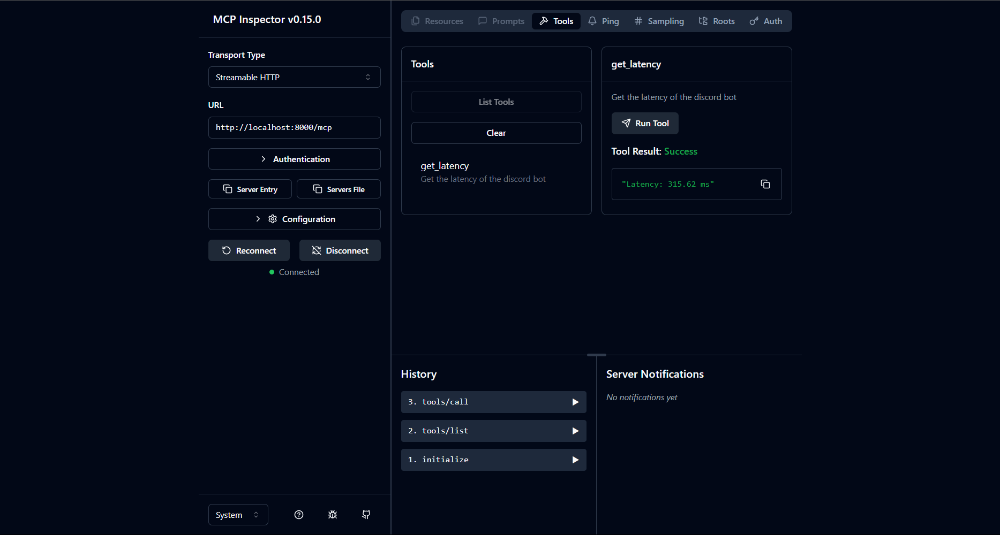

# Testing

To test the mcp server, there are two main methods:

- Utilizing the Claude `desktop` client.
  - For `stdio` server follow this guide [here](https://modelcontextprotocol.io/quickstart/server)
  - For `http` or remote server follow this guide [here](https://support.anthropic.com/en/articles/11175166-getting-started-with-custom-connectors-using-remote-mcp)
- Utilizing the `modelcontextprotocol/inspector` tool. Run it using `npx @modelcontextprotocol/inspector` and connect to the MCP server.

## Claude Desktop Client

### STDIO Server

```pwsh
code $env:APPDATA\Claude\claude_desktop_config.json
```

```json
{
    "mcpServers": {
        "discord": {
            "command": "poetry",
            "args": [
                "--directory",
                "C:\\Users\\<username>\\<projects_directory>\\discord-mcp",
                "run",
                "python",
                "-m",
                "discord_mcp",
                "--file-logging",
                "--server-type",
                "STDIO"
            ]
        }
    }
}
```

```
poetry --directory "C:\\Users\\<username>\\<projects_directory>\\discord-mcp" run python -m discord_mcp --file-logging --server-type STIO
```

### HTTP Server

Remote connectors are a `Pro and Max plans` feature. To use the remote connector, you need to set up a server that can be accessed over HTTP.

## Inspector Tool



### STDIO Server

Use this command in the inspector tool sidebar:

```pwsh
poetry --directory "C:\\Users\\<username>\\<projects_directory>\\discord-mcp" run python -m discord_mcp --file-logging --server-type STDIO
```

### HTTP Server

First run the server using:

```pwsh
poetry --directory "C:\\Users\\<username>\\<projects_directory>\\discord-mcp" run python -m discord_mcp --file-logging --server-type HTTP
```

Then, in the inspector tool, you can connect to the server by entering the URL:

```
http://localhost:8000/mcp
```
